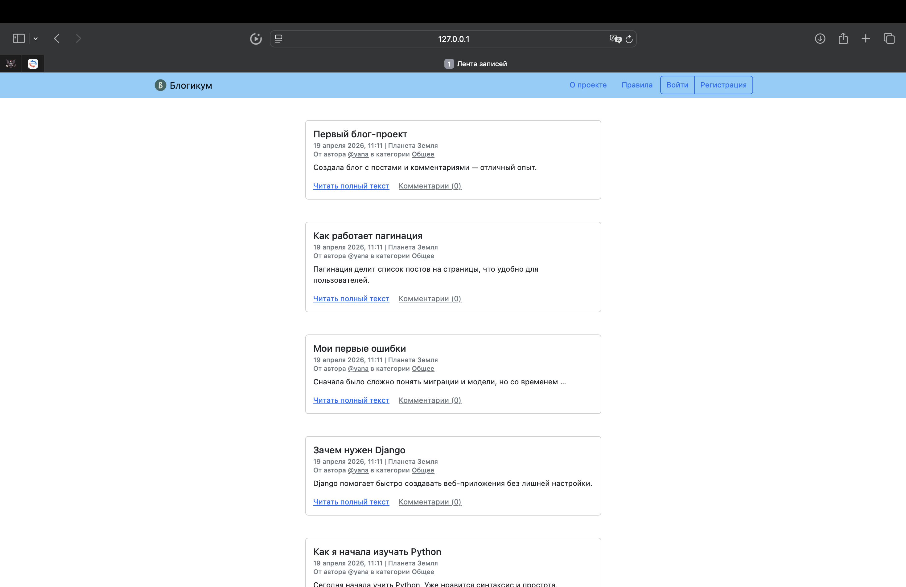

# Blogicum

Blogicum — это веб-приложение на Django, реализующее функциональность блоговой платформы с пользовательскими публикациями, комментариями и системой авторизации.

Проект демонстрирует базовые принципы backend-разработки: работу с базой данных, обработку пользовательских данных, разграничение доступа и построение веб-интерфейса.

---

## Функциональность

### Публикации

- создание постов авторизованными пользователями;

- редактирование и удаление собственных публикаций;

- поддержка отложенных публикаций;

- отображение постов на главной странице;

- фильтрация по категориям.

### Пользователи

- регистрация и авторизация;

- профиль пользователя с публикациями;

- редактирование данных профиля;

- смена пароля.

### Комментарии

- добавление комментариев к постам;

- редактирование и удаление своих комментариев;

- отображение количества комментариев.

### Категории

- группировка постов;

- отдельные страницы категорий.


## Технологии

- Python 3.10  

- Django 3.2  

- SQLite  

- Bootstrap 5  

- Pytest  


## Установка и запуск

### 1. Клонировать репозиторий

```bash

git clone <your-repo-url>

cd blogicum

```

### 2. Создать виртуальное окружение

macOS / Linux:

```bash

python3.10 -m venv venv

source venv/bin/activate

```

Windows:

```bash

python -m venv venv

venv\Scripts\activate

```

### 3. Установить зависимости

```bash

pip install --upgrade pip

pip install -r requirements.txt

```

### 4. Применить миграции

```bash

cd blogicum

python manage.py migrate

```


### 5. Запустить сервер

```bash

python manage.py runserver

```

Открыть в браузере:

http://127.0.0.1:8000/

---

## Админ-панель

Создать суперпользователя:

```bash

python manage.py createsuperuser

```

Админка доступна по адресу:

http://127.0.0.1:8000/admin/

---

## Тестирование

```bash

python -m pytest

```


## Особенности реализации

- Используется ORM Django  

- Реализовано разграничение доступа  

- Публикации фильтруются по статусу и дате  

- Комментарии связаны с постами  

- Применена пагинация  
